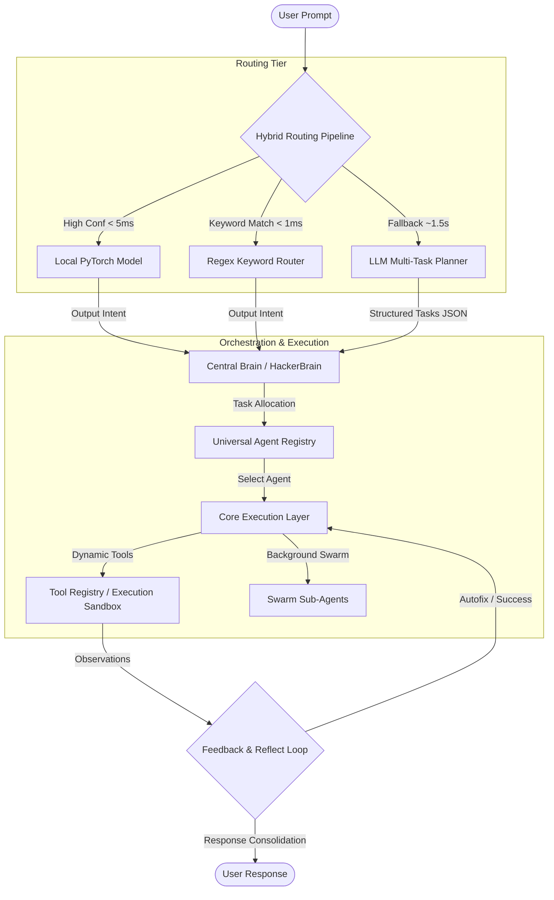
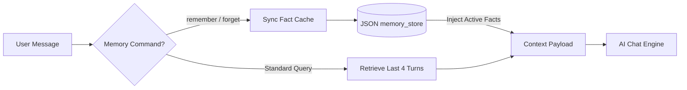

# AERIS System Architecture Map

This document details the software architecture of AERIS (MYTHOS), covering its multi-tier routing pipeline, agentic swarm hierarchy, tool execution ecosystem, memory structure, and unified services.

---

## 1. System Overview

AERIS is a high-performance, local-first agentic orchestrator. It uses a hybrid intelligence routing mechanism to combine the speed of local machine learning models with the cognitive capabilities of cloud LLM providers.



---

## 2. Intent Routing Pipeline

The routing pipeline handles user input by cascading from the fastest, cheapest layers to the most intelligent, expensive layers:

1. **Keyword Rules (O(1) - <1ms):** Checks high-frequency command structures (e.g. "open chrome", "send email").
2. **Local Neural Classifier (O(N) - <5ms):** A deep 3-layer feed-forward PyTorch network with residual skip connections trained on **5,145** unique Hinglish/English command examples. Features are extracted via an upgraded **1024-dimension TF-IDF vectorizer** supporting trigrams.
3. **LLM Planner (Fallback):** Parses multi-stage, complex prompts into a structured `BrainPlan` of dependency-mapped tasks.

---

## 3. Agent Swarm Hierarchy

AERIS categorizes its intelligence into **Core Agents** (which handle user-facing intents) and **Swarm Sub-Agents** (specialized modules under `ProjectBuilderSystem` for autonomous software creation).

```mermaid
graph TD
    subgraph Core Agents (25)
        ChatAgent[Chat]
        SecurityAgent[Security]
        SystemAgent[System]
        ResearchAgent[Research]
        SearchAgent[Search]
        CodingAgent[Code]
        ImageAgent[Image]
        AnalyzerAgent[Analyze]
        OSINTAgent[OSINT]
        EmailAgent[Email]
        SchedulerAgent[Scheduler]
        DranaAgent[Drana]
        DorkingAgent[Dorking]
        PentestAgent[Pentest]
        PhantomAgent[Phantom]
        LeakGraphAgent[LeakGraph]
        AntigravityAgent[Codepipeline]
        DiagnosisAgent[Diagnose]
        RepairAgent[Repair]
        DebateAgent[Debate]
        InvestigationAgent[Investigation]
        AuditAgent[Audit]
        ObserverAgent[Observer]
        ProactiveAgent[Proactive]
        ProjectBuilderSystem[ProjectBuilderSystem]
    end

    subgraph Swarm Sub-Agents (9)
        ProjectBuilderSystem --> AnalysisAgent[Analysis]
        ProjectBuilderSystem --> ArchitectureAgent[Architecture]
        ProjectBuilderSystem --> SwarmCodingAgent[Swarm Coding]
        ProjectBuilderSystem --> SwarmResearchAgent[Swarm Research]
        ProjectBuilderSystem --> DocumentationAgent[Documentation]
        ProjectBuilderSystem --> VulnerabilityAgent[Vulnerability]
        ProjectBuilderSystem --> RuntimeAgent[Runtime]
        ProjectBuilderSystem --> ToolManagerAgent[Tool Manager]
        ProjectBuilderSystem --> DelegatorAgent[Delegator]
    end
```

---

## 4. Memory & Context Architecture

The memory layer uses a persistent memory store to maintain state across conversational turns, and tracks execution history:



---

## 5. Tool & Services Ecosystem

AERIS has specialized tools integrated directly into its core modules:
* **Advanced NLP:** SpaCy entity extraction, NLTK sentiment analysis, parts-of-speech parsing.
* **Machine Learning:** Scikit-Learn classifiers, KMeans clustering, regression estimators.
* **Vision Engine:** OpenCV-based blur, thresholding, edge-detection, and grayscale filters.
* **Data Analytics:** Pandas descriptive statistics, Pearson correlation matrix calculators.
* **Cloud Simulator:** Mock VM provisioning operations and bucket manipulations.
* **Virtual Assistant Services:** Speech synthesis (TTS) engine, turn logger, recommendation system.
